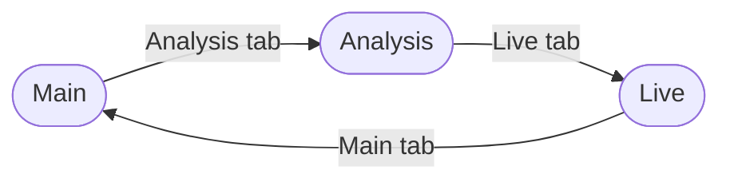
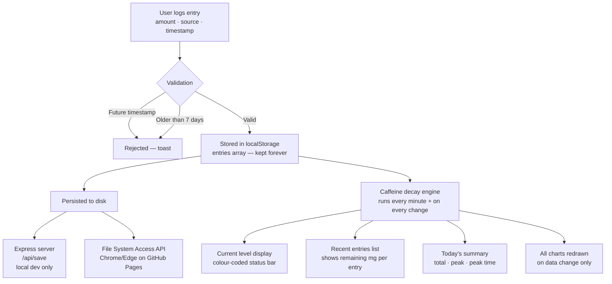
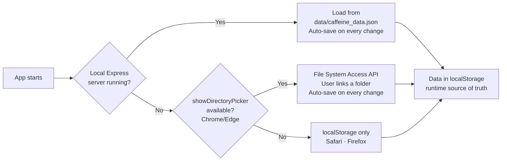
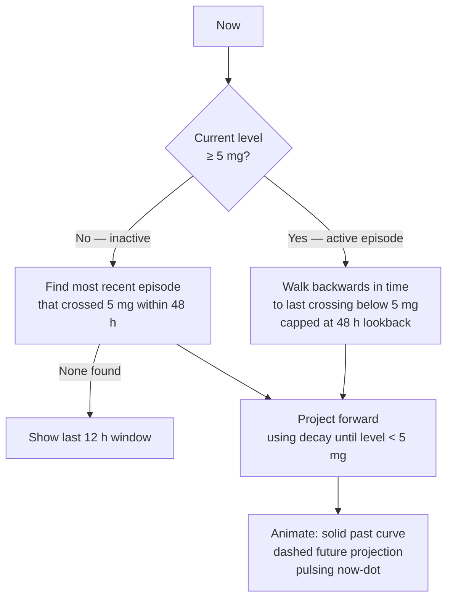

# Caffeine Tracker

A Progressive Web App for tracking caffeine intake and monitoring real-time caffeine levels using pharmacokinetic half-life decay.

**Live app → https://lukeburton02.github.io/caffeine-tracker/**

No install, no accounts, no cloud. All data stays in your browser.

---

## Pages



| Page | Contents |
|------|----------|
| **Main** | <ul><li>Current level display with colour-coded status bar</li><li>Quick Add presets (Celsius, Huel, Neutonic, Tenzing)</li><li>Custom entry form</li><li>Recent entries list with remaining mg</li><li>Today's summary — total consumed, peak level, peak time</li><li>7-day bar chart</li><li>Full history line chart (scrollable)</li></ul> |
| **Analysis** | <ul><li>Summary strip: 28-day avg · usual peak · avg bedtime · all-time total (since first entry)</li><li>7-day forecast with 80% prediction interval</li><li>Time-of-day intake pattern (weighted KDE)</li><li>Source breakdown histogram</li><li>Bedtime caffeine trend (scrollable, sticky y-axis)</li><li>Daily caffeine heatmap — GitHub-style calendar grid, personal quantile colour scale</li></ul> |
| **Live** | <ul><li>Animated real-time caffeine curve for the current episode</li><li>Solid past curve · dashed future projection · pulsing now-dot</li><li>Dynamic window: back to last &lt;5 mg crossing, forward to clearance</li></ul> |

---

## Data Flow



---

## Caffeine Decay Model

Caffeine is eliminated via first-order kinetics — the rate of elimination is proportional to the current concentration. This gives an exponential decay curve:

$$C(t) = C_0 \times 0.5^{t / t_{1/2}}$$

| Symbol | Meaning |
|--------|---------|
| $C(t)$ | Caffeine remaining at time $t$ (mg) |
| $C_0$ | Initial dose (mg) |
| $t$ | Hours elapsed since consumption |
| $t_{1/2}$ | Half-life (default **5 hours**; configurable 1–24 h) |

The total caffeine in system at any moment is the sum over all logged entries:

$$\text{Total}(t) = \sum_i d_i \times 0.5^{(t - t_i) / t_{1/2}}$$

**Peak calculation** — peak is sampled at the exact timestamp of each entry consumed today, not by interval sampling. This is correct because caffeine can only reach a local maximum immediately after a dose; it decays continuously thereafter. For example: 50 mg at 09:00 followed by 120 mg at 14:00 gives a peak of $50 \times 0.5^{5/5} + 120 = 145\text{ mg}$ at 14:00, not 170 mg.

**Typical half-life values:**

| Population | $t_{1/2}$ |
|------------|-----------|
| Healthy non-smoker adult | 3–5 hours |
| Oral contraceptive users | ~6–12 hours |
| Smokers | ~3 hours |
| Pregnancy (third trimester) | ~15 hours |
| Newborns | ~80 hours |

---

## Storage Priority Chain



localStorage is **always** the runtime source of truth. Disk/file saves are durable backups — they restore localStorage on startup if it was cleared.

Entries are **never auto-deleted** from localStorage. The recent entries list filters to ≥ 1 mg remaining and ≤ 7 days old for display, but all entries contribute to the current level calculation and all charts.

---

## Analysis Page Models

### 7-Day Forecast — Holt-Winters Triple Exponential Smoothing

When ≥ 14 days of history exist, the forecast uses the **additive Holt-Winters** model with weekly seasonality ($m = 7$):

$$L_t = \alpha(y_t - S_{t-m}) + (1-\alpha)(L_{t-1} + T_{t-1})$$

$$T_t = \beta(L_t - L_{t-1}) + (1-\beta)\,T_{t-1}$$

$$S_t = \gamma(y_t - L_t) + (1-\gamma)\,S_{t-m}$$

$$\hat{y}_{t+h} = L_t + h \cdot T_t + S_{t-m+(h \bmod m)}$$

Parameters: $\alpha = 0.3$ (level), $\beta = 0.1$ (trend), $\gamma = 0.2$ (seasonal)

80% prediction interval: $\hat{y} \pm 1.28 \times \text{RMSE} \times \sqrt{h}$

Falls back to **double exponential smoothing** (no seasonal component) when < 14 days of history are available.

### Time-of-Day Pattern — Weighted KDE

Each entry contributes a Gaussian kernel centred on its hour-of-day, scaled by its mg amount. Bandwidth is set by Silverman's rule, clamped to [0.4, 2.5] hours. Wrap-around at midnight is handled explicitly.

### Bedtime Caffeine

Applies the full decay model to estimate $\text{Total}(23{:}00)$ for each day in history — the caffeine level at 11 pm, which is most relevant for sleep quality.

---

## Live Episode Page



The animation loop runs via `requestAnimationFrame` and auto-pauses when the tab is hidden. It only runs when the Live page is active.

---

## Running Locally

```bash
npm run dev
```

Opens at `http://127.0.0.1:8080`. The Express server writes `data/caffeine_data.json` and `data/caffeine_data.csv` on every change and restores them on startup if localStorage is empty.

## Project Structure

```
caffeine-tracker/
├── src/
│   ├── index.html         # Three-page PWA shell (<script type="module">)
│   ├── app.js             # Event wiring, navigation, init, refreshUI/refreshAll
│   ├── calculations.js    # Pure math: half-life decay, computeLevelAt
│   ├── storage.js         # localStorage, Express API, File System Access, export
│   ├── toast.js           # showToast notification helper
│   ├── charts.js          # All canvas drawing functions + episode animation
│   ├── ui.js              # DOM updates: level display, entries, summary, modals
│   ├── styles.css         # Styling + dark mode
│   ├── service-worker.js  # PWA (network-first, no caching)
│   ├── manifest.json      # PWA config
│   └── icon.svg           # App icon
├── data/
│   ├── caffeine_data.json # Committed sample data (owner's real data)
│   └── caffeine_data.csv  # Same data in CSV format
├── server.js              # Express dev server (/api/save, /api/load)
├── .github/workflows/
│   └── deploy.yml         # Auto-deploy src/ to GitHub Pages on push to main
├── CLAUDE.md              # Non-obvious rules for AI-assisted development
├── TASKS.md               # Full development history and roadmap
└── README.md              # This file
```

## Tech Stack

- **Vanilla JS** (ES modules, no framework, no bundler)
- **Canvas API** for all charts (no charting libraries)
- **CSS custom properties + data attributes** for dark mode
- **localStorage** as primary runtime store
- **Express** (local dev only) for disk persistence
- **Service Worker** for PWA installability
- **GitHub Actions** → **GitHub Pages** for deployment

## Deployment

Every push to `main` triggers `.github/workflows/deploy.yml`, which uploads `src/` as a Pages artifact and deploys it. No build step — the source files are served directly.

## Notes

- Developed on an LSHTM machine. Before adding cloud sync, review LSHTM's policies on third-party data storage.
- Half-life default is 5 hours. Adjust in Settings (⚙) to match your individual metabolism.
- Settings modal (⚙) includes a link to this repository.
